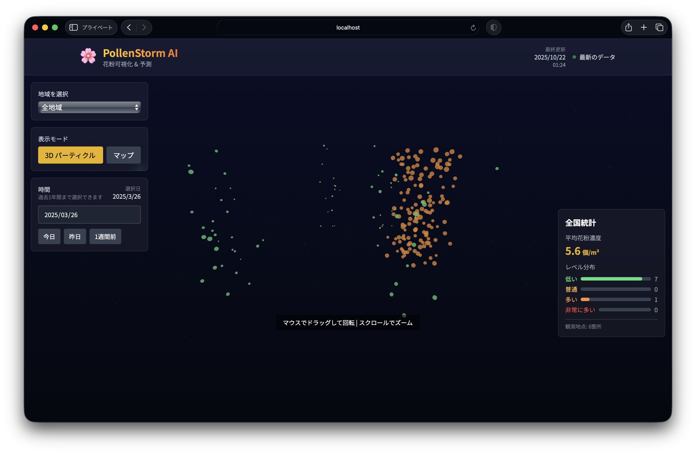

# 🌸 PollenStorm AI

<p align="center">
  
</p>

**リアルタイム日本花粉データ可視化 & AI予測システム**

PollenStorm AIは、日本の花粉データを3D可視化し、AIモデルで花粉レベルを予測するWebアプリケーションです。時系列データ表示、地域別詳細情報、インタラクティブな3D/マップビューを提供します。

    

---

## 🎯 主な機能

### 1. **時系列データ表示**
- 過去1年間の花粉データを表示
- 日付選択機能（カレンダーピッカー）
- 「今日」「昨日」「1週間前」のクイック選択
- 花粉シーズン（2月-5月）の自動判定

### 2. **3Dパーティクル可視化**
- React Three Fiberを使用した動的な3D花粉パーティクル表示
- 花粉レベルに応じた色分け表示（緑→黄→橙→赤）
- インタラクティブなカメラ操作（回転・ズーム）
- パーティクルクリックで地域詳細表示

### 3. **インタラクティブマップビュー**
- React Leafletによる日本地図上の花粉分布表示
- 地域別マーカーの色分け表示
- クリックで地域詳細情報を表示
- マップ⇔3D表示の切り替え

### 4. **AI予測システム**
- LSTM/回帰アンサンブルモデルによる花粉レベル予測
- 気象データ（気温、湿度、風速、風向）を考慮
- 信頼度スコア付き予測結果
- 地域別予測値とリスクレベル表示

### 5. **詳細地域情報**
- 地域選択による詳細パネル表示
- リアルタイム花粉レベル・気象データ
- AI予測結果と影響要因分析
- 観測時刻・データソース情報

---

## 📁 プロジェクト構造

```
pollen_storm/
├── src/                          # Next.js フロントエンド
│   ├── app/
│   │   ├── layout.tsx           # アプリレイアウト・メタデータ
│   │   ├── page.tsx             # メインページロジック
│   │   └── globals.css          # TailwindCSS・グローバルスタイル
│   ├── components/
│   │   ├── Header.tsx           # ヘッダー・接続状況表示
│   │   ├── RegionSelector.tsx   # 地域選択ドロップダウン
│   │   ├── PollenStats.tsx      # 統計サマリー表示
│   │   ├── PredictionPanel.tsx  # AI予測結果パネル
│   │   ├── PollenVisualization.tsx  # 3Dパーティクル可視化
│   │   ├── MapView.tsx          # Leafletマップビュー
│   │   └── LoadingScreen.tsx    # ローディング画面
│   ├── hooks/
│   │   └── usePollenData.ts     # データ取得・正規化フック
│   ├── types/
│   │   └── index.ts             # TypeScript型定義
│   └── utils/
│       └── pollenLevels.ts      # 花粉レベル判定ユーティリティ
├── ml-model/                     # Python FastAPI サービス
│   ├── main.py                  # FastAPIメインサーバー
│   ├── models/
│   │   ├── predictor.py         # AI予測モデル
│   │   ├── pollen_model.keras   # 訓練済みモデルファイル
│   │   └── pollen_model_metadata.json
│   ├── data/
│   │   ├── data_fetcher.py      # データ収集・キャッシュ管理
│   │   ├── generate_sample_data.py
│   │   ├── cache/               # 日別キャッシュファイル
│   │   ├── static/              # 静的サンプルデータ
│   │   └── realtime_client/     # リアルタイムクライアント
│   ├── utils/
│   │   └── websocket_manager.py # WebSocket管理
│   ├── requirements.txt         # Python依存関係
│   ├── train_model.py           # モデル訓練スクリプト
│   └── generate_mock_data.py    # モックデータ生成
├── backend/                      # Node.js Express バックエンド
│   ├── server.js                # Expressサーバー（WebSocket対応）
│   ├── package.json             # Node.js依存関係
│   ├── routes/                  # APIルート定義
│   │   ├── pollen.js
│   │   ├── predictions.js
│   │   └── weather.js
│   └── services/                # ビジネスロジック・サービス
│       ├── dataCollector.js
│       ├── pollenService.js
│       ├── predictionService.js
│       ├── weatherService.js
│       └── websocket.js
├── shared/                       # 共有データ・型定義
│   ├── prefectures.json         # 都道府県データ
│   └── types.ts                 # 共通型定義
├── package.json                 # フロントエンド依存関係
├── next.config.js               # Next.js設定
├── tailwind.config.js           # Tailwind CSS設定
├── setup.sh                     # 自動セットアップスクリプト
├── QUICKSTART.md               # クイックスタートガイド
└── README.md                    # このファイル
```

---

## 🚀 セットアップ手順

### 前提条件

- **Node.js** 18.0以上
- **Python** 3.9以上
- **npm** または **yarn** (Yarn 4.x PnP対応)

### 🎯 クイックスタート（推奨）

**最速セットアップ:**
```bash
# リポジトリのクローン
git clone <repository-url>
cd pollen_storm

# 自動セットアップスクリプトを実行
chmod +x setup.sh
./setup.sh
```

このスクリプトが以下を自動実行します：
- フロントエンド依存関係のインストール（Yarn 4 PnP）
- Python仮想環境の作成
- ML依存関係のインストール
- 両サービスの起動

**アクセス URL:**
- 🎨 フロントエンド: http://127.0.0.1:3000
- 🔮 MLサービス: http://127.0.0.1:8001
- 📚 API Docs: http://127.0.0.1:8001/docs

### 📝 手動セットアップ

#### 1. フロントエンドのセットアップ

```bash
# 依存関係のインストール
npm install
# または Yarn 4の場合
corepack enable
corepack yarn install

# 環境変数の設定
cp .env.local.example .env.local
```

`.env.local`を編集：
```env
NEXT_PUBLIC_ML_SERVICE_URL=http://localhost:8001
```

#### 2. MLサービスのセットアップ

```bash
cd ml-model

# Python仮想環境の作成
python3 -m venv venv
source venv/bin/activate  # Windows: venv\Scripts\activate

# 依存関係のインストール
pip install -r requirements.txt
```

#### 3. バックエンドのセットアップ（オプション）

```bash
cd backend

# 依存関係のインストール
npm install

# 環境変数の設定
cp .env.example .env
```

---

## 🎮 実行方法

### 🚀 開発サーバーの起動

**ターミナル 1: MLサービスの起動**
```bash
cd ml-model
source venv/bin/activate  # 仮想環境をアクティブ化
uvicorn main:app --reload --port 8001
```
→ サービスが起動: `http://localhost:8001`

**ターミナル 2: フロントエンドの起動**
```bash
npm run dev
# または yarn dev
```
→ アプリケーションが起動: `http://localhost:3000`

**ターミナル 3: バックエンドの起動（オプション）**
```bash
cd backend
npm run dev
```
→ バックエンドが起動: `http://localhost:8000`

### 📊 動作確認

1. **フロントエンド**: http://localhost:3000
   - 3D可視化またはマップビューが表示される
   - 地域選択ドロップダウンが機能する
   - 時間選択（今日・昨日・1週間前）が動作する

2. **MLサービス**: http://localhost:8001/docs
   - FastAPI Swagger UIが表示される
   - APIエンドポイントのテストが可能

3. **APIテスト**:
   ```bash
   # 現在データの取得
   curl http://localhost:8001/data/current

   # 予測データの取得
   curl http://localhost:8001/predict

   # 特定日付のデータ取得
   curl "http://localhost:8001/data/current?date=2024-03-15"
   ```

---

## 🧪 API エンドポイント

### MLサービス（Port 8001）

#### `GET /data/current`
現在の花粉データを取得（日付指定・地域フィルタ対応）

**パラメータ:**
- `region` (optional): 特定地域のデータのみ取得
- `refresh` (optional): キャッシュを強制更新
- `date` (optional): 特定日付のデータ取得（YYYY-MM-DD形式）

```bash
# 全地域の現在データ
curl http://localhost:8001/data/current

# 特定地域のデータ
curl http://localhost:8001/data/current?region=tokyo

# 特定日付のデータ
curl "http://localhost:8001/data/current?date=2024-03-15"

# キャッシュ強制更新
curl http://localhost:8001/data/current?refresh=true
```

#### `GET /predict`
AI予測データを取得

**パラメータ:**
- `region` (optional): 特定地域の予測のみ取得
- `days` (optional): 予測日数（デフォルト: 1日）
- `refresh` (optional): 入力データのキャッシュ更新
- `date` (optional): 基準日指定

```bash
# 全地域の明日予測
curl http://localhost:8001/predict

# 特定地域の予測
curl http://localhost:8001/predict?region=tokyo

# 複数日予測
curl http://localhost:8001/predict?days=3

# 過去日付を基準とした予測
curl "http://localhost:8001/predict?date=2024-03-15"
```

#### `GET /historical`
過去データを取得

```bash
# 過去30日間のデータ
curl http://localhost:8001/historical

# 特定地域の過去データ
curl http://localhost:8001/historical?region=tokyo&days=7
```

#### `GET /model/info`
AIモデル情報を取得

```bash
curl http://localhost:8001/model/info
```

#### `POST /train`
モデル再訓練（管理者用）

```bash
curl -X POST http://localhost:8001/train
```

### バックエンドサービス（Port 8000）※オプション

#### `GET /health`
ヘルスチェック

#### `GET /api/pollen/*`
花粉データ関連エンドポイント

#### `GET /api/predictions/*`
予測データ関連エンドポイント

#### `GET /api/weather/*`
気象データ関連エンドポイント

---

## 📊 データフォーマット

### PollenData（正規化後）

```json
{
  "id": "tokyo",
  "timestamp": "2024-10-20T12:00:00Z",
  "prefecture": "東京都",
  "region": "東京",
  "coordinates": {
    "lat": 35.6762,
    "lng": 139.6503
  },
  "pollenCount": 45.2,
  "pollenLevel": "moderate",
  "weatherData": {
    "temperature": 18.5,
    "humidity": 65.0,
    "windSpeed": 3.5,
    "windDirection": 180.0,
    "pressure": 1013.2,
    "rainfall": 0.0,
    "condition": "晴れ",
    "observedAt": "2024-10-20T11:30:00Z",
    "source": "JMA"
  }
}
```

### PollenPrediction

```json
{
  "prefecture": "東京都",
  "region": "東京",
  "date": "2024-10-21T12:00:00Z",
  "predictedLevel": "high",
  "confidence": 0.87,
  "factors": {
    "temperature": 2.1,
    "humidity": -1.3,
    "windSpeed": -0.8,
    "historicalTrend": 7.2
  }
}
```

### 花粉レベル定義

```typescript
type PollenLevel = 'low' | 'moderate' | 'high' | 'very_high';

// レベルと色の対応
const POLLEN_COLORS = {
  low: '#4ade80',        // 緑 - 少ない (0-10個/cm²)
  moderate: '#fbbf24',   // 黄 - 普通 (11-30個/cm²)
  high: '#fb923c',       // 橙 - 多い (31-50個/cm²)
  very_high: '#ef4444'   // 赤 - 非常に多い (51個以上/cm²)
};
```

---

## 🧠 AIモデル & データ管理

### データアーキテクチャ

PollenStorm AIは**時系列データ表示**に特化したアーキテクチャを採用しています：

1. **キャッシュベースシステム**
   - 過去1年間の日別データを事前キャッシュ
   - `ml-model/data/cache/pollen_YYYYMMDD.json`形式で保存
   - 高速な日付別データアクセス

2. **フォールバック機能**
   - 欠損データは静的サンプルで補完
   - `ml-model/data/static/pollen/`の地域別JSONを利用
   - 一貫したデータ提供を保証

3. **花粉シーズン自動判定**
   - 2月-5月を花粉シーズンとして認識
   - シーズン外は前年度データを参照
   - カレンダー選択範囲を動的調整

### 予測モデル

**アンサンブル構成:**
- **ベースモデル**: 回帰ベース（現在の花粉数 × 0.7）
- **気象要因**: 気温・湿度・風速の影響を加算
- **確率的変動**: ±20%のランダム要素

**特徴量:**
1. `pollen_today` - 現在の花粉数（主要予測子）
2. `temperature` - 気温（°C）
3. `humidity` - 湿度（%）
4. `wind_speed` - 風速（m/s）
5. `wind_direction` - 風向（度）
6. `day_of_year` - 年間通算日

**予測式:**
```python
prediction = (
    pollen_today * 0.7 +
    max(0, (temperature - 15) * 2) +
    -max(0, (humidity - 50) * 0.5) +
    -wind_speed * 1.5 +
    seasonal_factor +
    random_variation(-0.2, +0.2)
)
```

### 環境変数設定

| 変数名                            | デフォルト値                               | 説明                         |
| --------------------------------- | ------------------------------------------ | ---------------------------- |
| `REALTIME_SAMPLE_FILE`            | `ml-model/data/static/sample_regions.json` | 統合サンプルデータファイル   |
| `POLLEN_API_STATIC_DIR`           | `ml-model/data/static/pollen`              | 地域別静的データディレクトリ |
| `POLLEN_WARM_CACHE_DAYS`          | `1`                                        | 起動時キャッシュウォーム日数 |
| `POLLEN_FAILURE_COOLDOWN_SECONDS` | `300`                                      | API失敗時のクールダウン時間  |

### データ生成・更新

**サンプルデータ生成:**
```bash
cd ml-model
python -m data.generate_sample_data
```

**キャッシュ更新:**
```bash
# 特定日付のキャッシュ更新
curl "http://localhost:8001/data/current?date=2024-03-15&refresh=true"

# モデル再訓練
curl -X POST http://localhost:8001/train
```

---

## 🎨 フロントエンド技術詳細

### UI/UX機能

**時間選択インターフェース:**
- カレンダーピッカー（過去1年間選択可能）
- クイック選択ボタン（今日・昨日・1週間前）
- 花粉シーズン自動判定・範囲制限
- 選択日の日本語表示

**表示モード切替:**
- 3Dパーティクル ⇔ マップビューの瞬時切替
- 地域選択状態の保持
- パフォーマンス最適化（Dynamic Import）

**地域詳細パネル:**
- 選択地域の詳細情報表示
- リアルタイム気象データ
- AI予測結果・信頼度表示
- 閉じるボタン・ESCキー対応

### デザインシステム

**カラーパレット:**
```css
:root {
  --pollen-low: #4ade80;       /* 緑 - 少ない */
  --pollen-moderate: #fbbf24;  /* 黄 - 普通 */
  --pollen-high: #fb923c;      /* 橙 - 多い */
  --pollen-very-high: #ef4444; /* 赤 - 非常に多い */
  --bg-dark: #0a0e27;          /* メイン背景 */
  --bg-darker: #050810;        /* 濃い背景 */
}
```

**グラスモーフィズム:**
```css
.glass {
  background: rgba(255, 255, 255, 0.1);
  backdrop-filter: blur(10px);
  border: 1px solid rgba(255, 255, 255, 0.2);
}
```

**フォント:**
- **メインフォント**: Noto Sans JP
- **ウェイト**: 400 (Regular), 500 (Medium), 700 (Bold)
- **Variable Font**: `--font-noto-sans-jp`

---

## 🧩 テクノロジースタック

### フロントエンド
- **Next.js 14** - React フルスタックフレームワーク（App Router）
- **React 18** - UIライブラリ（TypeScript）
- **@react-three/fiber** - React Three.js統合
- **@react-three/drei** - Three.js ヘルパーライブラリ
- **React Leaflet** - 地図表示ライブラリ
- **Tailwind CSS** - ユーティリティファーストCSS
- **TypeScript** - 静的型チェック

### バックエンド・ML
- **FastAPI** - 高速Python Webフレームワーク
- **uvicorn** - ASGI Webサーバー
- **TensorFlow** - 機械学習フレームワーク
- **NumPy** - 数値計算ライブラリ
- **aiohttp** - 非同期HTTPクライアント
- **websockets** - WebSocket サポート

### 開発・ビルドツール
- **Yarn 4 (PnP)** - パッケージマネージャー（Zero-Install）
- **corepack** - Node.js パッケージマネージャー管理
- **ESLint** - JavaScript/TypeScript リンター
- **Autoprefixer** - CSS プリフィックス自動付与

### バックエンドサービス（オプション）
- **Express.js** - Node.js Webフレームワーク
- **WebSocket (ws)** - リアルタイム通信
- **node-cron** - スケジュールタスク実行
- **helmet** - セキュリティミドルウェア

---

## 🔧 カスタマイズ・拡張

### 新しい地域の追加

`ml-model/data/static/sample_regions.json`に地域データを追加：

```json
{
  "region": "新潟",
  "prefecture": "新潟県",
  "latitude": 37.9025,
  "longitude": 139.0238,
  "pollen_count": 25.0,
  "temperature": 15.2,
  "humidity": 70.0,
  "wind_speed": 2.1,
  "wind_direction": 270.0,
  "rainfall": 0.0
}
```

### 実際のAPIとの連携

`ml-model/data/data_fetcher.py`で外部API接続を実装：

```python
async def fetch_from_api(self, url: str) -> Dict:
    headers = {
        'User-Agent': 'PollenStorm AI',
        'Accept': 'application/json'
    }
    async with aiohttp.ClientSession() as session:
        async with session.get(url, headers=headers) as response:
            return await response.json()
```

### カラーテーマのカスタマイズ

`src/utils/pollenLevels.ts`で花粉レベル色を変更：

```typescript
export const POLLEN_COLORS = {
  low: '#your-color-1',
  moderate: '#your-color-2',
  high: '#your-color-3',
  very_high: '#your-color-4'
};
```

### 新しい予測要因の追加

`ml-model/models/predictor.py`で予測ロジックを拡張：

```python
def predict(self, current_data: Dict, days: int = 1) -> Dict:
    # 新しい要因（例：UV指数）を追加
    uv_factor = current_data.get('uv_index', 0) * 0.1

    prediction = (
        base_prediction +
        temperature_factor +
        humidity_factor +
        wind_factor +
        uv_factor  # 新要因
    )
```

---

---

## 🚀 デプロイ

### フロントエンド（Vercel推奨）

```bash
# ビルドテスト
npm run build

# Vercel デプロイ
npx vercel --prod
```

**環境変数設定:**
```
NEXT_PUBLIC_ML_SERVICE_URL=https://your-ml-service.herokuapp.com
```

### MLサービス（Render/Railway推奨）

**Dockerfile作成:**
```dockerfile
FROM python:3.9-slim
WORKDIR /app
COPY ml-model/requirements.txt .
RUN pip install -r requirements.txt
COPY ml-model/ .
CMD ["uvicorn", "main:app", "--host", "0.0.0.0", "--port", "8001"]
```

**Render.com設定:**
- Build Command: `pip install -r requirements.txt`
- Start Command: `uvicorn main:app --host 0.0.0.0 --port $PORT`

### バックエンド（オプション）

**Node.js デプロイ:**
```bash
cd backend
npm run start
```

**Heroku設定:**
```json
{
  "scripts": {
    "start": "node server.js"
  },
  "engines": {
    "node": "18.x"
  }
}
```

---

## � トラブルシューティング

### よくある問題

**1. `npm install`でエラー**
```bash
# node_modulesクリア後に再インストール
rm -rf node_modules package-lock.json
npm install --legacy-peer-deps
```

**2. Python依存関係エラー**
```bash
# 仮想環境の再作成
cd ml-model
rm -rf venv
python3 -m venv venv
source venv/bin/activate
pip install --upgrade pip
pip install -r requirements.txt
```

**3. Three.js 3D表示エラー**
- ブラウザのWebGLサポートを確認
- ハードウェアアクセラレーションを有効化
- ブラウザキャッシュをクリア

**4. ポート競合エラー**
```bash
# 使用中ポートの確認
lsof -i :3000
lsof -i :8001

# 別ポートで起動
npm run dev -- --port 3001
uvicorn main:app --port 8002
```

**5. Yarn PnP関連エラー**
```bash
# Yarn設定のリセット
rm -rf .yarn/cache .pnp.*
corepack yarn install
```

### ログ確認

**フロントエンド:**
- ブラウザ開発者ツール → Console
- Next.js ターミナル出力

**MLサービス:**
- uvicorn サーバーログ
- FastAPI自動生成ドキュメント: `/docs`

**デバッグモード有効化:**
```bash
# FastAPI詳細ログ
uvicorn main:app --reload --log-level debug

# Next.js デバッグ
DEBUG=* npm run dev
```

---

## 📈 パフォーマンス最適化

### フロントエンド

**Dynamic Import使用:**
```typescript
// 重い3Dコンポーネントの遅延読み込み
const PollenVisualization = dynamic(
  () => import('@/components/PollenVisualization'),
  { ssr: false }
);
```

**メモ化最適化:**
```typescript
// useCallback/useMemoでレンダリング最適化
const memoizedData = useMemo(() =>
  processPollenData(rawData), [rawData]
);
```

### バックエンド

**キャッシュ戦略:**
- 日別データキャッシュ（1日保持）
- 予測結果キャッシュ（1時間保持）
- 静的フォールバックデータ

**非同期処理:**
- aiohttp非同期HTTPクライアント
- FastAPI非同期エンドポイント
- バックグラウンドタスク実行

---

## �📄 ライセンス

MIT License

---

## 🙏 謝辞

- **気象データ**: 日本気象協会（JMA）
- **地図データ**: OpenStreetMap
- **3Dライブラリ**: Three.js コミュニティ
- **フレームワーク**: Next.js・FastAPI開発チーム

---

## 📞 サポート・コントリビューション

### ドキュメント
- **詳細セットアップ**: `QUICKSTART.md`
- **API仕様**: http://localhost:8001/docs
- **コンポーネント設計**: `src/components/README.md`
